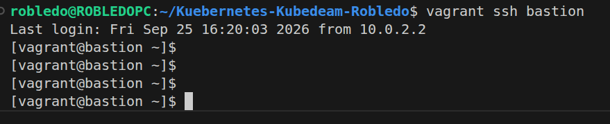
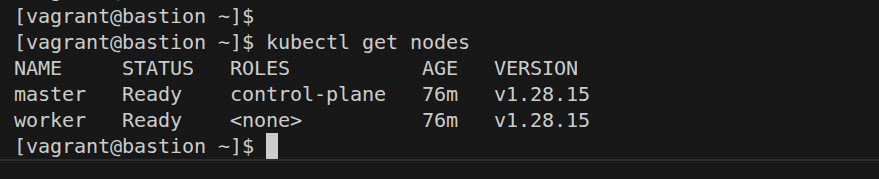
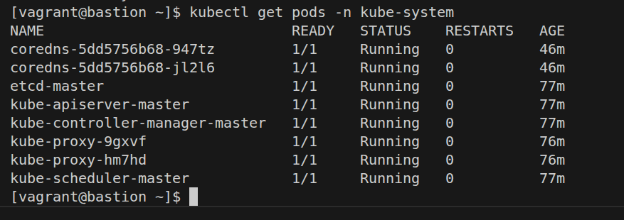
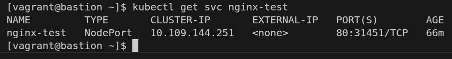
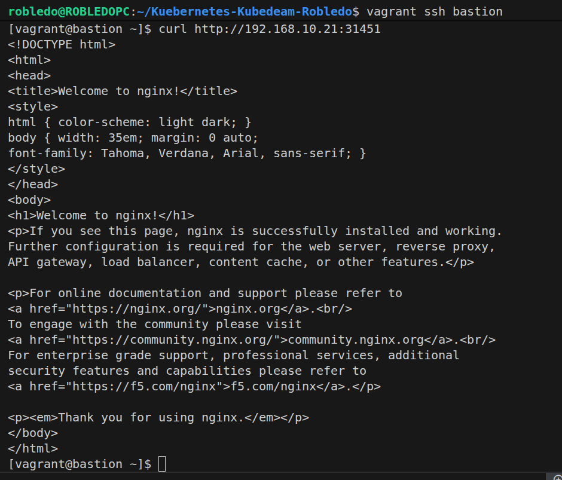
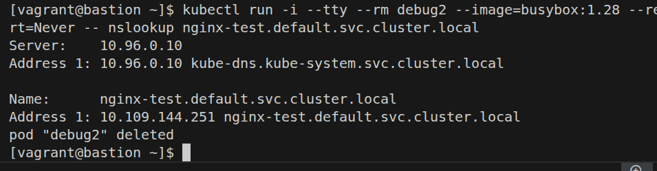
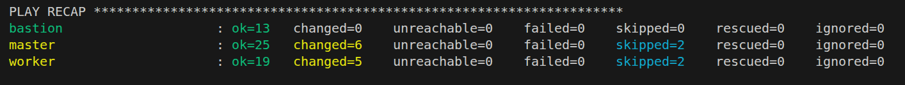

# Despliegue de Clúster de Kubernetes con kubeadm en Rocky Linux 9

Este repositorio contiene la solución completa y automatizada utilizando **Vagrant** y **Ansible** para desplegar un clúster funcional de Kubernetes siguiendo los requerimientos de la actividad práctica.

## Arquitectura de Infraestructura

El entorno consta de 3 máquinas virtuales aprovisionadas automáticamente sobre VirtualBox:

1. **Servidor Bastión (`bastion`)**: Actúa como servidor DHCP, DNS y punto de administración central con `kubectl`.
2. **Nodo Master (`master`)**: Control Plane del clúster (2 CPUs, 2GB RAM).
3. **Nodo Worker (`worker`)**: Nodo para cargas de trabajo (1 CPU, 2GB RAM).

La red interna (`lab_net`) asigna direcciones IP fijas mediante reservaciones DHCP en el Bastión, basadas en las direcciones MAC configuradas en Vagrant para los nodos Master y Worker.

---

## Fases de Desarrollo Implementadas

### Fase 1: Configuración del Servidor Bastión
- **Resolución de Red y Servicios**: Despliegue automatizado de **BIND9** para resolución de nombres interna (`santiago.gomez.lab`) y **DHCPd** para asignación de IPs.
- **Reservas DHCP**: Se configuraron IPs estáticas ligadas a la MAC para el Master (`192.168.10.20`) y el Worker (`192.168.10.21`).

### Fase 2: Preparación de Nodos Kubernetes (Master y Worker)
Mediante el rol de Ansible `k8s_common`, se acondicionaron los sistemas operativos:
- **Ajustes de Sistema**: Desactivación permanente de la memoria **Swap** (vía `/etc/fstab`) y SELinux en modo permisivo.
- **Kernel y Red**: Carga automática de los módulos `overlay` y `br_netfilter`, y ajuste de parámetros `sysctl` para habilitar el reenvío IPv4 y procesamiento `iptables`.
- **Instalación de Software**: Instalación de `containerd.io` configurado para usar `SystemdCgroup = true`. Instalación de las herramientas base: `kubeadm`, `kubelet` y `kubectl`.

### Fase 3: Inicialización del Clúster
- **Master (`k8s_master`)**: 
  - Apertura de puertos en `firewalld` (6443, 2379-2380, 10250, UDP 8285/8472).
  - Inicialización con `kubeadm init` indicando la IP de escucha y la subred de pods (`10.244.0.0/16`).
  - Despliegue del plugin de red CNI **Flannel** (`kube-flannel.yml`).
- **Worker (`k8s_worker`)**: 
  - Unión automática al clúster delegando la solicitud del token seguro al Master en tiempo de ejecución.
- **Administración Remota**: Configuración del archivo `admin.conf` para ser exportado y consumido desde el servidor Bastión, permitiendo gestionar el clúster externamente.

*(Captura: Ingresando al servidor Bastión para administrar el clúster)*


### Fase 4: Validación y Pruebas
Comprobación de operatividad final:

**1. Validación de estado `Ready` en los nodos**


**2. Verificación de los servicios base del clúster (CoreDNS, Flannel, etc.)**


**3. Despliegue de un `Deployment` de prueba (Nginx) expuesto mediante `NodePort`**


**4. Validación del consumo web apuntando a la IP del Worker**


**5. Resolución DNS interna del clúster mediante `CoreDNS` lanzando un pod interactivo (`busybox`)**


---

## Ejecución Automatizada (Evidencia)

La infraestructura fue aprovisionada utilizando **Vagrant** y **Ansible**, sin requerir intervención manual durante el proceso de instalación. El siguiente resumen muestra la finalización de las tareas sin fallos (`failed=0`):



### Instrucciones de Uso

1. Clonar el repositorio.
2. Ejecutar la creación y aprovisionamiento automático:
   ```bash
   vagrant up
   ```
3. Acceder al Bastión para administrar el clúster:
   ```bash
   vagrant ssh bastion
   kubectl get nodes
   ```